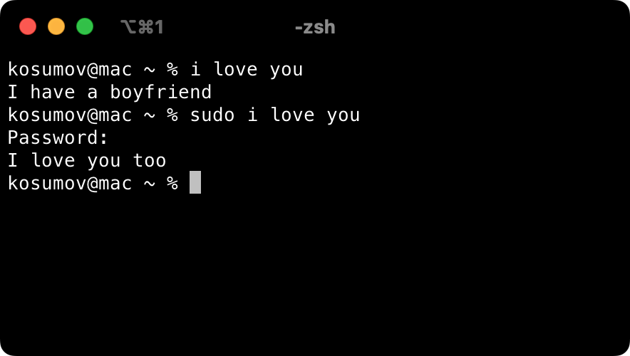

# Sudo I Love You
It's a commonly used joke structure, using the linux command "sudo", which forces the program to do what is commanded. The joke is typically structured a conversation between a boy and a girl. It reads:

> Boy: I love you Girl: I have a boyfriend Boy: **sudo** I love you Girl: I love you too

## Installation
    $ go install github.com/kosumoff/i@latest

## Usage
    $ i love you

